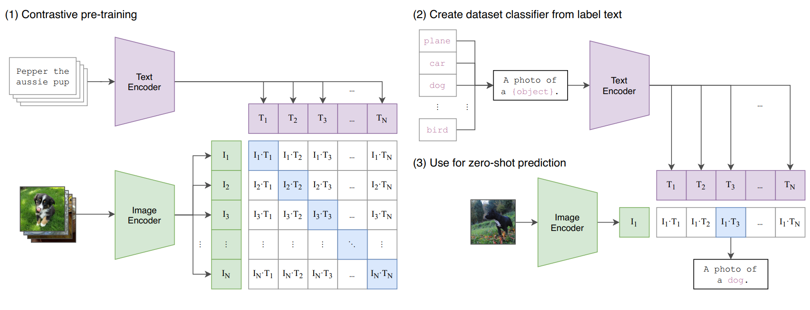

# CLIP (Contrastive Language-Image Pre-Training) by OpenAI 

## Global view

In the [inference](https://github.com/toto-a/NeuralNet-Variety/tree/main/CLIP/inference) folder you will find an implementation of clip using pre-trained models liek Distill-Bert for the text encoder and a ResNet 50 for the image encoder. The model is then trained on the Flicker8k datasets.

The parent folder contains an implementation from scratch

## Architecture 

