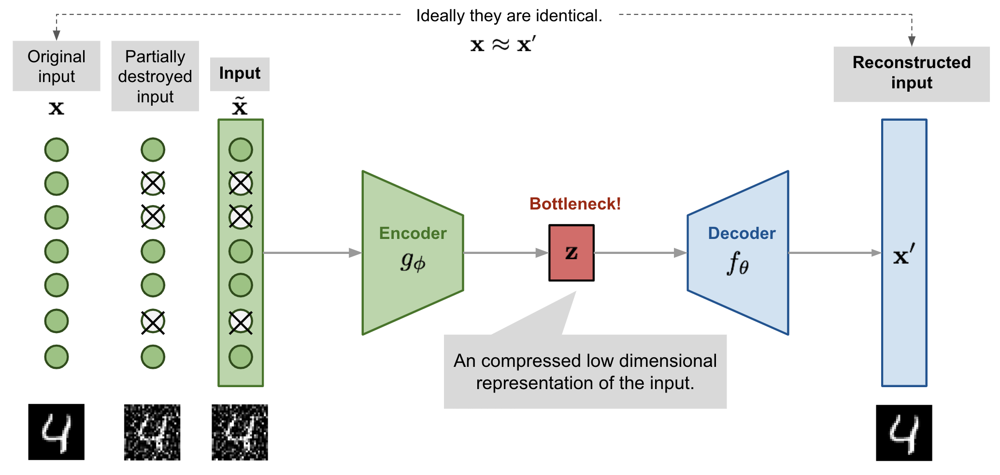

# Auto-encoders

## Classical AE (linear or conv)

AE as shown in the image below, their goal is given an input is to convert it into a lower representational dimension. And from this lower dimension the decoder should be able to reproduce the original data as close as possible.

## Variational AE 

The problem with traditional auto-encoders is that the latent space doesn't make sense. It doesn't hold any semantic relationship between the data or a lack of regularity (continuity and completness). The main goal of VAE, is to be able to use the decder for new content generation. 
However, in order to introduce some regularisation of the latent space, we proceed to a slight modification of the encoding-decoding process: instead of encoding an input as a single point, we encode it as a distribution over the latent space. The model is then trained as follows:

-first, the input is encoded as distribution over the latent space.

-second, a point from the latent space is sampled from that distribution.

-third, the sampled point is decoded and the reconstruction error can be computed.

-finally, the reconstruction error is backpropagated through the network.

## VQ - VAE 

