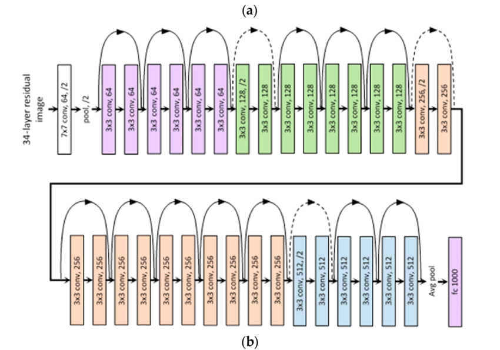

# ResNet

The implementation of the well-known ResNet network, because of the nature of residual connection( adding the identity mapping, learning the residual or how to deviate from the input, more stable gradient)
we are able to construct or train more deeper network that before (ex : VGG19). 

The architecture below : 

