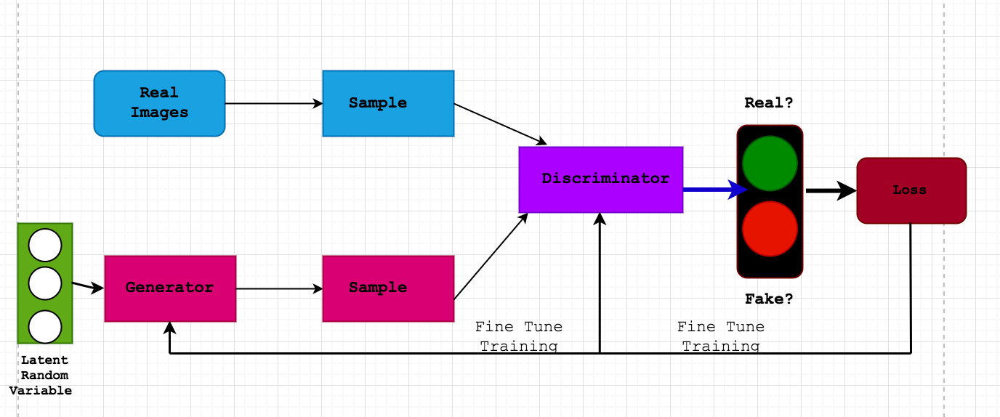
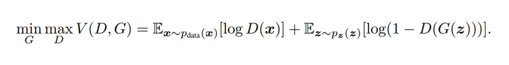

# GANs

## Overview

A collection of traditional gans (linear and convolutional) and WGAN, see below for the architecture and the loss computation.

## Traditional GAN

## WGAN 

Go [there](https://github.com/toto-a/NeuralNet-Variety/tree/main/GANs/WGAN)
