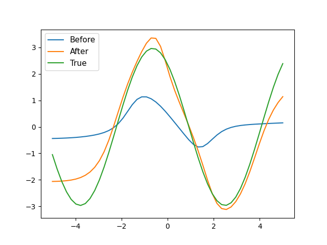

# Meta-Learning (or Learning to learn)

Meta-learning in general is to develop models (or algorithms) that can learn from different tasks and adapt their process. So to enable a model to generalize to different tasks
See the example below for a sinusoidal function : 

