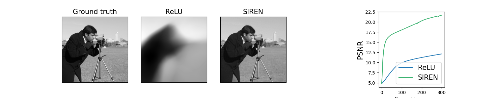

# An implementation of the paper _Implicit Neural Representations with Periodic Activation Functions_

## Introduction 
Neural nets in general are naturally biased toward low frequencies informations, so to capture the global context of the image (high frequencies) we could used positional embeddings (NeRF) or sine actiation fonction (SIREN) 

## Results
Results obtained after training for 300 epochs :

